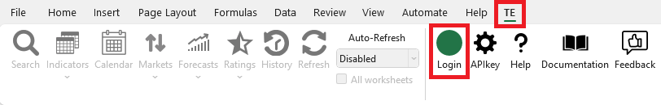
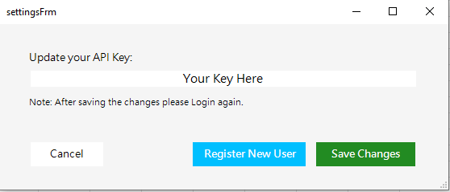
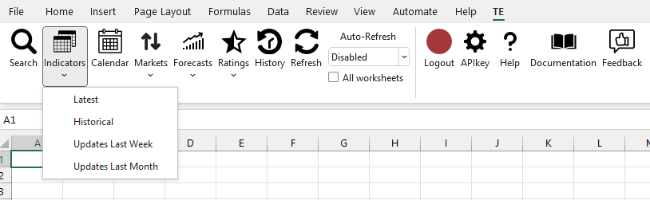

    
# Trading Economics - Excel

The Trading Economics Application Programming Interface (API) provides direct access to our data. It allows you to download millions of rows of historical data, to query our real-time economic calendar and to subscribe to updates. Providing several request methods to query our databases, with samples available in different programming languages, it is the best way to export data in XML, CSV or JSON format. The API can be used to feed a custom developed application, a public website or just off-the-shelf software like Microsoft Excel. More at:

[https://tradingeconomics.com/analytics/api.aspx](https://tradingeconomics.com/analytics/api.aspx)

#

## Installation

The Trading Economics Excel Add-In installer can be downloaded here: 

[https://github.com/tradingeconomics/tradingeconomics/tree/master/Excel/All_Releases](https://github.com/tradingeconomics/tradingeconomics/tree/master/Excel/All_Releases)

<strong>Requirements: </strong>Microsoft Windows with Excel 2010, 2013 or 2016 and Office 365.
 Download the installer, launch it and follow the instructions.

<strong>Note: </strong>If Windows shows a warning just click on "More info" and then install.

#

## Authentication
* Open Excel, click on TE tab and then on Login

* Place your Client key or "guest:guest"

#### <strong>Note:</strong> If you don't have a client key it will default to guest:guest and a sample of data will be provided or you can get your free key here:
[https://developer.tradingeconomics.com](https://developer.tradingeconomics.com)

#

## Sample Usage

* After doing the login it will enable the options available on choosed plan

#

## Documentation

[https://docs.tradingeconomics.com/excel/](https://docs.tradingeconomics.com/excel/)

#

## Learn More

https://tradingeconomics.com/analytics/api.aspx

