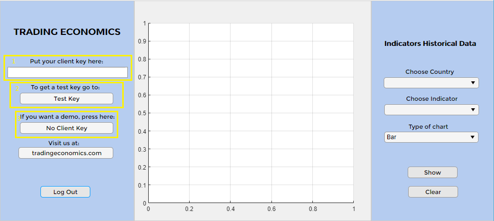
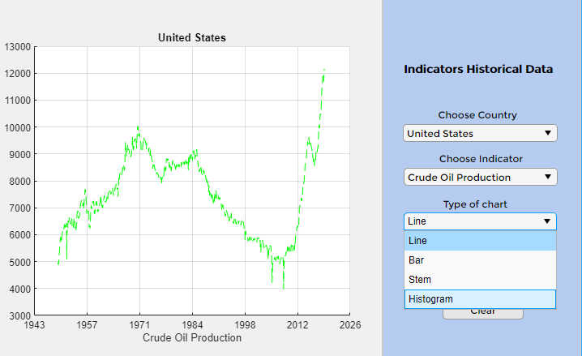
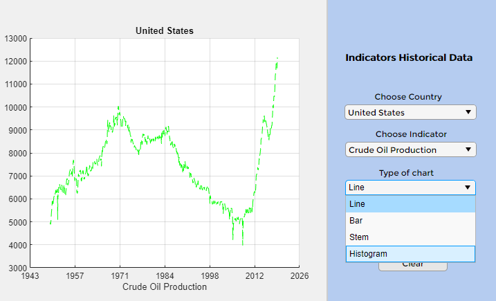
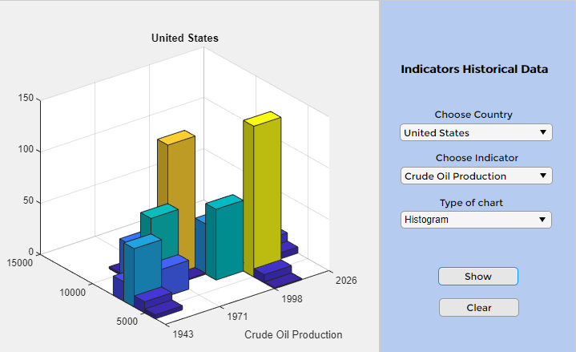

# Trading Economics GUI (graphical user interface)

### Sample app created in *MatLab App Designer*, to get indicators historical data graphically.

#### MatLab version: *MatLab R2019a*

### To clone this project you can follow the steps on [MathWorks Documentation](https://www.mathworks.com/help/simulink/ug/clone-git-repository-or-check-out-svn-repository.html)

### You can also download the Add-on from MatLab Toolstrip, on the Home tab, in the Environment section, click the Add-Ons icon:

```
- Find the add-on by browsing through available categories on the left side of the Add-On Explorer window. Use the search bar to search for an add-on using a keyword.

- Click the add-on to open its detailed information page.

- On the information page, click Add to install the add-on.
```

## How to use the Trading Economics GUI

```
1 - Put your client key.
2 - A test key will only give you access to a sample of countries.
3 - Press "No Client Key" to just see a demo.
```


```
Choose one country and one indicator, press "Show" to see the chart
```


```
Choose type of chart
```


```
Press "Show"
```

