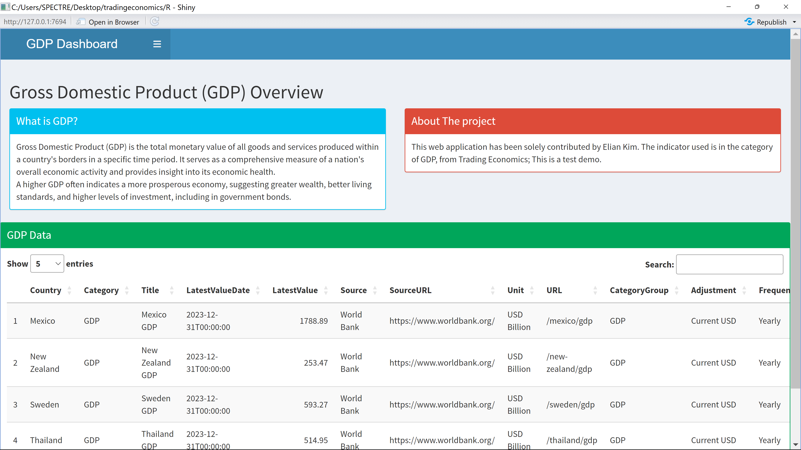

# Additional Output from `app.R`

This file provides detailed outputs generated by the `app.R` script for the Shiny application.

## 1. Overview of the Application

The application visualizes various data metrics using interactive `Plotly` graphs, data tables, and geospatial maps. Below are examples of the key outputs from the app.



### 2. Data Table Output

The application displays a ranked data grid of the GDP data for several countries using the `DT` package. Here is a snapshot of the interactive data table generated:

.png)

### 3. GDP Comparison Plot

One of the key visualizations is a `Plotly` chart that compares the GDP of Mexico, New Zealand, Sweden, and Thailand. The chart is fully interactive, allowing zooming, panning, and tooltip details.

.png)

### 4. Geospatial GDP Map

The application also features a geolocated `Plotly` map that visualizes GDP data across different regions.

.png)

These images represent just a few of the features of the `app.R` Shiny application. The app provides dynamic and interactive visualizations of GDP for insightful analysis.

Feel free to explore the full app for more detailed views and functionality.

## 6. How to Run the App Locally

To run the Shiny application locally, use the following commands in R:

```r
# Install required packages
install.packages(c('shiny', 'shinydashboard', 'plotly', 'DT', 'maps', 'dplyr'))

# Run the app
shiny::runApp('path_to_your_app_folder')
