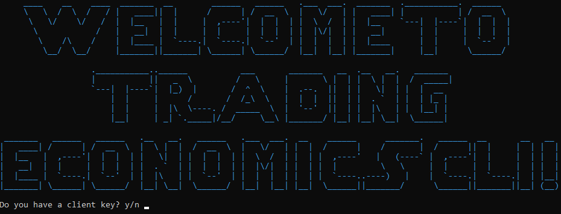
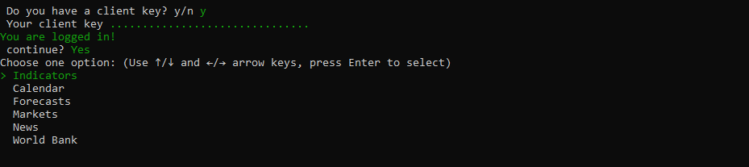
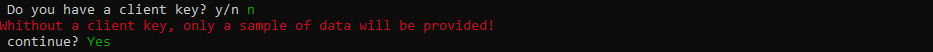
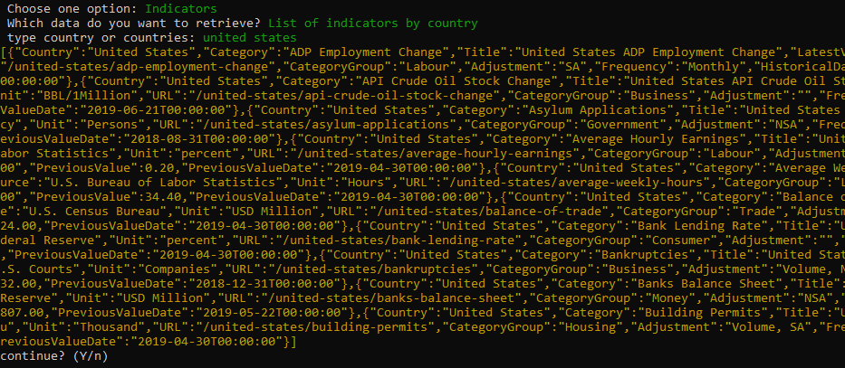

# Trading Economics Command Line Interface(CLI)
The Trading Economics Application Programming Interface (API) provides direct access to our data. It allows you to download millions of rows of historical data, to query our real-time economic calendar and to subscribe to updates. Providing several request methods to query our databases, with samples available in different programming languages, it is the best way to export data in XML, CSV or JSON format. The API can be used to feed a custom developed application, a public website or just off-the-shelf software like Microsoft Excel. More at:

[https://tradingeconomics.com/analytics/api.aspx](https://tradingeconomics.com/analytics/api.aspx)

#### <strong>Note:</strong> If you don't have a client key a sample of data will be provided or you can get your free key here:
[https://developer.tradingeconomics.com](https://developer.tradingeconomics.com)


# Setup Ruby CLI and Examples:

### First install Ruby (you can get if from):


[https://www.ruby-lang.org/en/downloads/](https://www.ruby-lang.org/en/downloads/)


### Clone our repo

```bash
git clone https://github.com/tradingeconomics/tradingeconomics.git
```

### Open a command prompt and go to TEcli.rb path

#### This script requires some *'gems':*

* For command line commands: tty-prompt
```Ruby
gem install tty-prompt
```
* For command line commands: tty-command
```Ruby
gem install tty-command
```
* For font styles: tty-font
```Ruby
gem install tty-font
```
* For http requests: httparty 
```Ruby
gem install httparty
```
* For coloring: colorize
```Ruby
gem install colorize
```

### To run the script type *ruby* before the file name
```Ruby
c:\path\to\folder>ruby TEcli.rb
```

## CLI:




* Type *'y'* if you have a client key 



* Type *'n'* to get a demo only



* Choose from the options on the menu
In this case was: Indicators by country



* Choose *'n'* to exit, or *'y'* to go back to the main menu