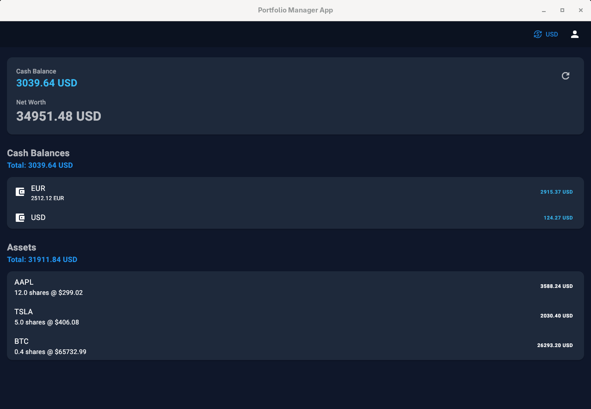
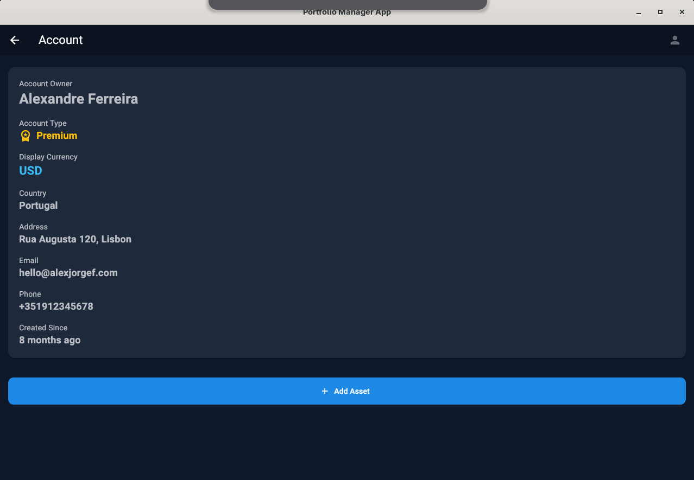
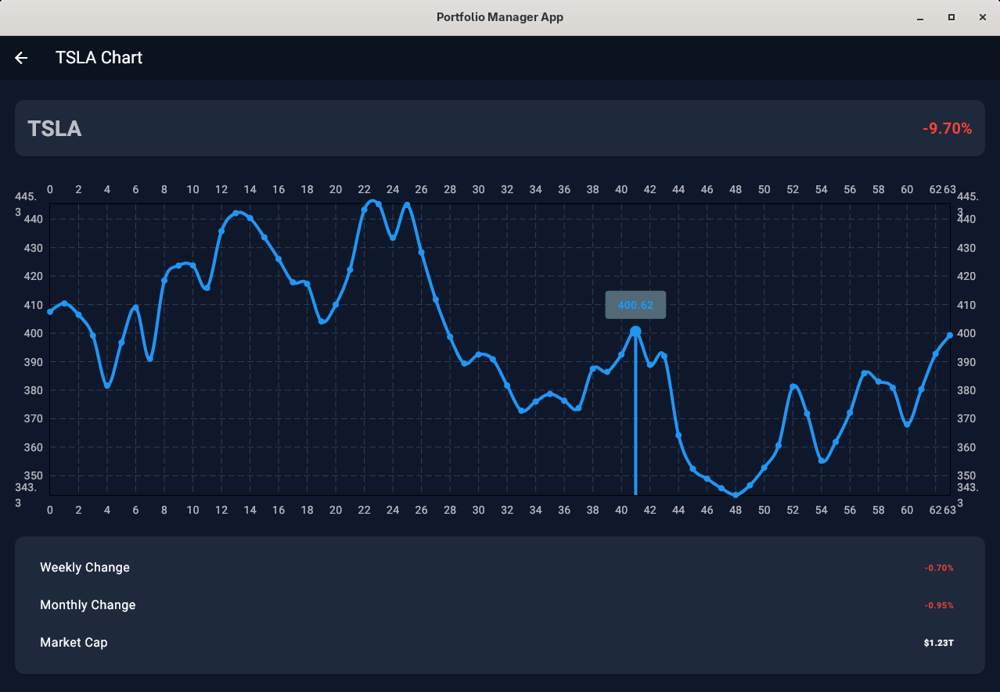

# Portfolio Manager App

This is an example of an Flutter app to manage portfolio a account. The project was initially created with `flutter create` CLI using Flutter v3.44.1 (Dart v3.12.1).

* Support for multiple asset types: stocks, and cryptocurrencies (APPL, TSLA, GOOGL, BTCUSD)
* Support for multiple currencies (USD, EUR, GBP, JPY)

## Demo Example

Back-End Logs:

```log
INFO:     Uvicorn running on http://127.0.0.1:8000 (Press CTRL+C to quit)
INFO:     Started reloader process [117079] using WatchFiles
INFO:     Started server process [117096]
INFO:     Waiting for application startup.
2026-06-16 17:19:40,444 - DEBUG - te_provider - te.login(api_key=***)
2026-06-16 17:19:40,444 - INFO - main - Starting Portfolio Manager backend (PID=117096,offline=False,is_auth=True)
INFO:     Application startup complete.
INFO:     127.0.0.1:49026 - "GET /api/v1/health HTTP/1.1" 200 OK
2026-06-16 17:19:48,321 - DEBUG - te_provider - te.getMarketsBySymbol(symbols=['AAPL:US', 'TSLA:US', 'GOOGL:US', 'BTCUSD:CUR'])
2026-06-16 17:19:48,805 - DEBUG - te_provider - te.getCurrencyCross(cross=USD)
INFO:     127.0.0.1:49028 - "GET /api/v1/accounts/1001 HTTP/1.1" 200 OK
INFO:     127.0.0.1:49034 - "GET /api/v1/rates HTTP/1.1" 200 OK
2026-06-16 17:22:12,359 - DEBUG - te_provider - te.getHistorical(symbol=TSLA:US)
INFO:     127.0.0.1:54152 - "GET /api/v1/market/TSLA HTTP/1.1" 200 OK
INFO:     127.0.0.1:54154 - "GET /api/v1/history/TSLA HTTP/1.1" 200 OK
```

Screenshots:

<div style="display: flex; justify-content: space-between;">
  
  
  
</div>

## Requirements

* Flutter v3
* Portfolio Manager Back-End - [python/examples/portfolio_manager_backend](../../../python/examples/portfolio_manager_backend/README.md)

## Getting Started

Initialize project (Only run once):

```shell
flutter doctor # For initial sanity checks
# git clone ...
cd flutter/examples/portfolio_manager_app
flutter pub get # Install dependecies
```

Run app:

```shell
cd flutter/examples/portfolio_manager_app
flutter run -d linux # Run w/ Linux device
flutter run -d AAAAAAA0000000 # Run w/ Android device
```

Test app:

```shell
cd flutter/examples/portfolio_manager_app
dart analyze # Run static analysis
flutter test # Run all tests
```
