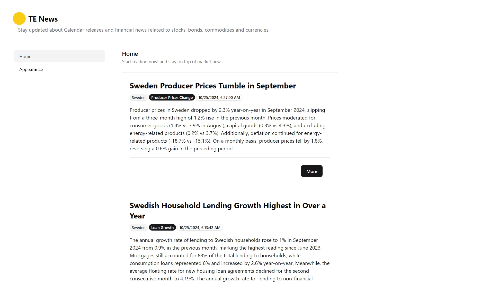

# Trading Economics - HTML - News
Stay updated about Calendar releases and financial news related to
stocks, bonds, commodities and currencies.

# How to run
> [!NOTE]  
> You can simply open the `index.html` in your browser, otherwise if that doesnt work follow the below steps.

## Prerequisites
- NodeJs
- Npm
- `cd` into this folder (`./html`)

## Steps
1. Then run `npx http-server .` in your terminal
2. It will prompt you that it will install `http-server` just hit Enter.
3. Next open the url it shows in the browser.

