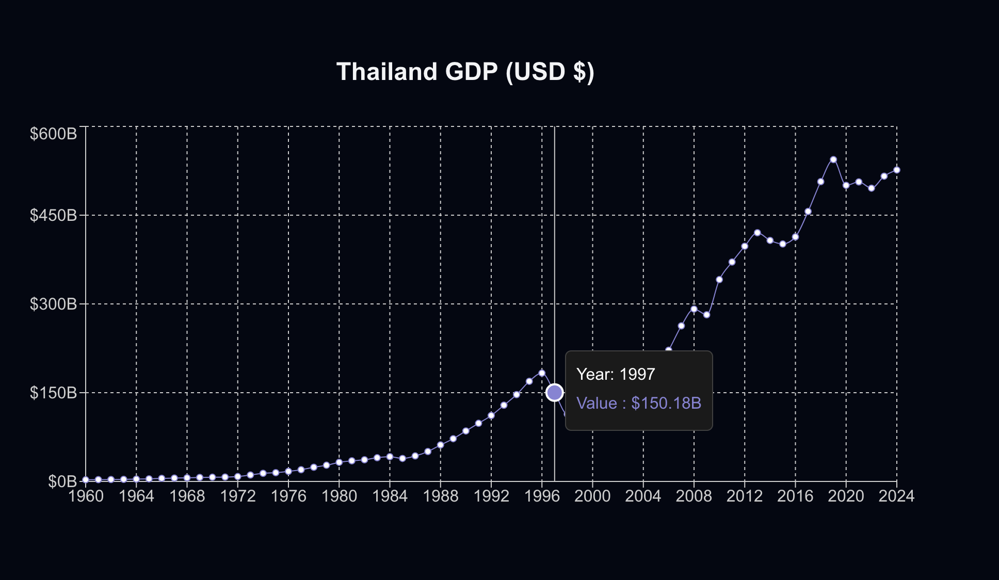

This application contains a single page to display historical data of Thailand's GDP.

 

## Environment Setup

Before running the application, you need to configure your environment variables:

1. Create a `.env.local` file in the root directory of the project
2. Add your Trading Economics API key:
   ```
   API_KEY=your_trading_economics_api_key_here
   ```

## Getting Started

To run the development server:

```bash
npm run dev
```
Open [http://localhost:3000](http://localhost:3000) with your browser to see the result.


## Deploy on Vercel

The easiest way to deploy your Next.js app is to use the [Vercel Platform](https://vercel.com/new?utm_medium=default-template&filter=next.js&utm_source=create-next-app&utm_campaign=create-next-app-readme) from the creators of Next.js.

Check out our [Next.js deployment documentation](https://nextjs.org/docs/app/building-your-application/deploying) for more details.

