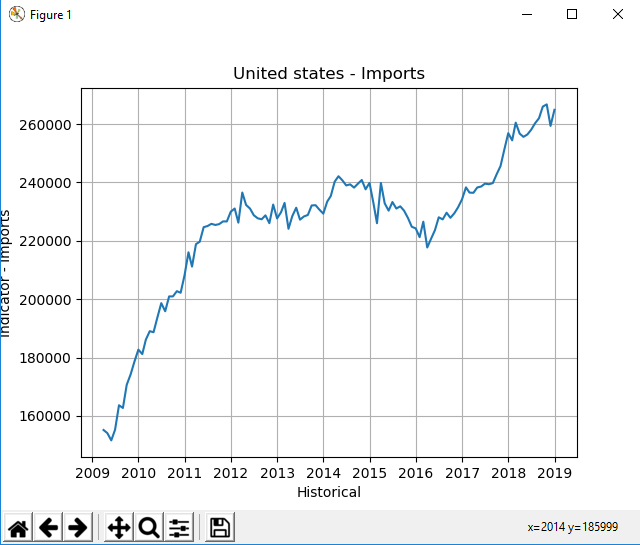

#Historical examples

In this folder you can find examples on how to get historical data using python.
Remember that without a client key to login, only a sample of data will be provided.

#**historicalEx**

Shows how to get data with diferent parameters, and output types.

*You can get a pandas DataFrame output.*

```python
                   0
2009-12-31  14418.74
2010-12-31  14964.37
2011-12-31  15517.93
2012-12-31  16155.26
2013-12-31  16691.52
2014-12-31  17427.61
2015-12-31  18120.71
2016-12-31  18624.48
2017-12-31  19390.60
```
*And a dictionary (dict) output:*

```python
{'United States': {'GDP': [dict_values([2016-12-31    18624.48
2017-12-31    19390.60
Name: 0, dtype: float64])], 'Population': [dict_values([2016-12-31    323.41
2017-12-31    325.72
Name: 0, dtype: float64])]}, 'Germany': {'GDP': [dict_values([2015-12-31    3375.61
2016-12-31    3477.80
2017-12-31    3677.44
Name: 0, dtype: float64])], 'Population': [dict_values([2015-12-31    81.20
2016-12-31    82.18
2017-12-31    82.52
Name: 0, dtype: float64])]}}
```

#**historicalChart**

Shows you how to get a simple chart with *matplotlib(Python 2D plotting library)* 

*Output should look like this:*

