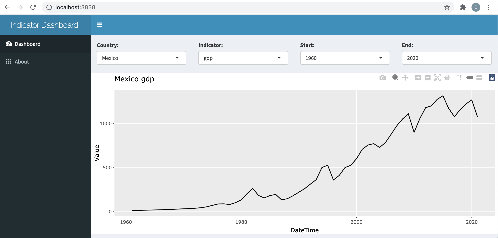
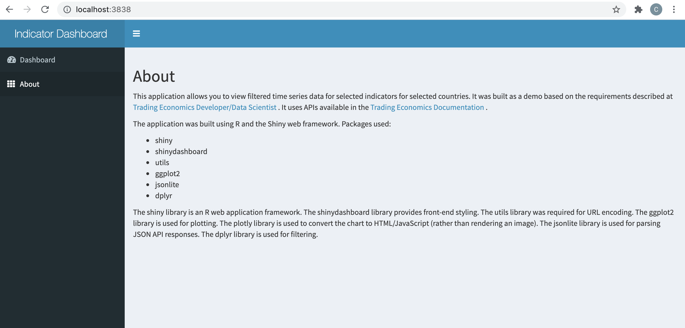

# Description

An R Shiny Application that allows you to view filtered time series data for selected indicators for selected countries 
from tradingeconomics.com.

# Build

The API key must be passed at build time.  The key is available from [tradingeconomics key management](https://developer.tradingeconomics.com/Home/KeyManagement) when logged in as a developer.

The container strips environment variables, so the key cannot be passed at runtime.  Instead, they are passed at build time as a build argument and written to a file read during server startup.  

```
docker build --build-arg te_api_key='<API KEY>' . -t country-indicator-demo
```

# Run 

```
docker run --rm -p 3838:3838 country-indicator-demo
```

To run an interactive bash session (for debugging, identifying files etc):
```
docker run -i -t  --rm country-indicator-demo /bin/bash
```

# View

Open the [application](http://localhost:3838/) in a browser.





