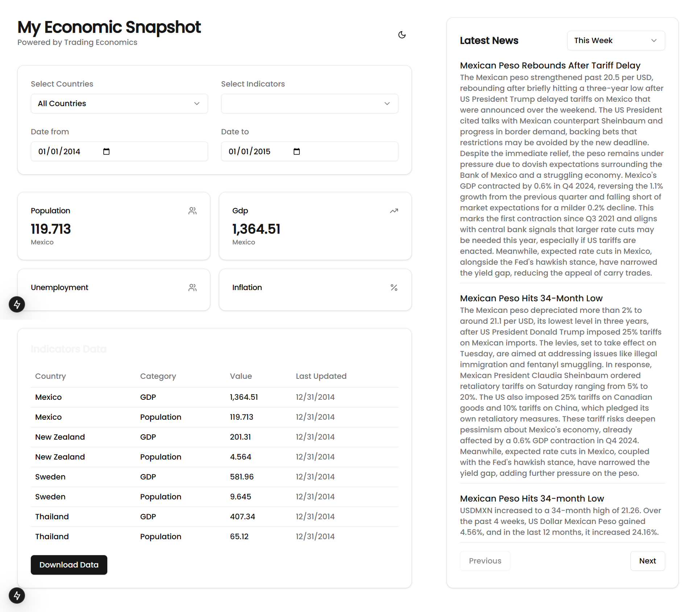

# Economic Data Dashboard - Trading Economics API Integration

This project is a web application that fetches and displays economic indicators and news data using the Trading Economics API. It was developed as part of a web developer job application to demonstrate proficiency in front-end development, API integration, and data visualization.

## Table of Contents

*   [Project Overview](#project-overview)
*   [Features](#features)
*   [Technologies Used](#technologies-used)
*   [Installation and Setup](#installation-and-setup)
*   [API Key](#api-key)
*   [Usage](#usage)
*   [Challenges and Approach](#challenges-and-approach)
*   [Future Improvements](#future-improvements)
*   [Author](#author)

## Project Overview

The Economic Data Dashboard is a single-page application (SPA) built with Next.js and React that allows users to:

1. Select multiple countries and economic indicators.
2. View historical data for the selected indicators within a specified date range.
3. Visualize indicator data in a tabular format with options for downloading.
4. Read recent news articles related to the selected countries.
5. Toggle between light and dark mode.

## Features

### Implemented

*   **Dynamic Data Fetching:** Fetches indicator and news data from the Trading Economics API based on user selections (countries, indicators, date ranges).
*   **Data Visualization:**
    *   Displays indicator data in a clear table with country, category, value, and date.
    *   Presents news articles with title, source, URL, and date.
*   **User Interface:**
    *   Utilizes Shadcn UI components for a modern and consistent look.
    *   Provides interactive elements like dropdowns (Select), date pickers (Input), and buttons.
    *   Implements pagination for news articles.
*   **Date Range Selection:**
    *   Offers predefined date range options (Today, This Week, This Month) for news.
    *   Allows custom date range selection for both indicators and news.
*   **Data Download:** Enables users to download indicator data in XLSX format using the `xlsx` library.
*   **Responsive Design:** Adapts to different screen sizes using Tailwind CSS.
*   **Theme Toggle:** Allows users to switch between light and dark themes using `next-themes`.

### Partially Implemented/Not Working

*   **News API Optimization:** The news API call is currently delayed by 3 seconds due to potential rate-limiting issues with the free tier of the Trading Economics API. This was done to avoid overwhelming the API and ensure some data is retrieved, but it is not an ideal solution for a production application.
*   **All/Some Countries/Indicators Selector:** While the UI elements are present, selecting all countries or indicators does not currently affect the API calls as intended, due to the limitations of the free API tier, all the countries and indicators can not be retrieved at once. This needs further investigation and potential UI adjustments to communicate these limitations to the user.

## Technologies Used

*   **Front-End:**
    *   [Next.js](https://nextjs.org/) - React framework for building server-side rendered and static web applications.
    *   [React](https://reactjs.org/) - JavaScript library for building user interfaces.
    *   [TypeScript](https://www.typescriptlang.org/) - Typed superset of JavaScript for improved code quality.
    *   [Shadcn UI](https://ui.shadcn.com/) - UI component library built with Radix UI and Tailwind CSS.
    *   [Tailwind CSS](https://tailwindcss.com/) - Utility-first CSS framework.
    *   [date-fns](https://date-fns.org/) - JavaScript date utility library.
    *   [xlsx](https://www.npmjs.com/package/xlsx) - Library for working with Excel files.
    *   [lucide-react](https://lucide.dev/)- Library for icons
    *   [next-themes](https://www.npmjs.com/package/next-themes)- Library to change the themes
*   **API Integration:**
    *   [axios](https://axios-http.com/) - Promise-based HTTP client for making API requests.
    *   [Trading Economics API](https://tradingeconomics.com/api/) - Provides economic data and news.

## Installation and Setup

1. **Clone the repository:**

    ```bash
    git clone <repository-url>
    cd <repository-name>
    ```

2. **Install dependencies:**

    ```bash
    npm install
    # or
    yarn install
    # or
    pnpm install
    

3. **Run the development server:**

    ```bash
    npm run dev
    # or
    yarn dev
    # or
    pnpm dev
    ```

4. **Open in your browser:**

    *   Visit `http://localhost:3000` in your web browser.

## API Key

This project requires an API key from Trading Economics. 

## Usage

1. **Select Countries:** Use the "Select Countries" dropdown to choose one or more countries.
2. **Select Indicators:** Use the "Select Indicators" dropdown to choose one or more economic indicators.
3. **Set Date Range (Indicators):** Use the "Date from" and "Date to" inputs to define the historical data range for indicators.
4. **Select Date Range (News):** Choose a predefined range (Today, This Week, This Month) or select "Custom" to manually set the date range using the "News Date from" and "News Date to" inputs.
5. **View Data:**
    *   The indicator data will be displayed in a table below the form.
    *   News articles will appear in a separate card on the right side of the screen.
6. **Download Data:** Click the "Download Data" button to download the indicator data as an XLSX file.
7. **Navigate News:** Use the "Previous" and "Next" buttons to paginate through news articles.
8. **Change Theme:** Click the sun/moon icon in the top right corner to toggle between light and dark themes.

## Challenges and Approach

*   **API Limitations:** The free tier of the Trading Economics API has limitations on the request rate and the amount of data that can be retrieved. I encountered issues with fetching all countries or indicators simultaneously. My current approach is to allow single selection to show the core functionality and delay the news API calls to avoid rate-limiting errors.
*   **Asynchronous Data Fetching:** I used `async/await` and `useEffect` hooks in React to manage asynchronous API calls and update the UI efficiently.
*   **Data Transformation:** The raw API data required some processing to be displayed correctly in the table. I used JavaScript's `map` and `find` methods to transform and filter the data as needed.
*   **Error Handling:** I implemented basic error handling to catch API request errors and display error messages to the user.
*   **Component Structure:** I broke down the UI into smaller, reusable components (`IndicatorsSection` and `NewsSection`) to improve code organization and maintainability.

## Future Improvements

*   **API Key Management:** Implement a more robust solution for handling the API key, potentially using server-side rendering or API routes in Next.js to avoid exposing the key in the client-side code.
*   **Optimize News API Calls:** Research and implement a better strategy for handling the news API calls, such as caching responses, using web sockets for real-time updates (if available), or implementing a more sophisticated queuing mechanism to manage request rates.
*   **Handle "All" Countries/Indicators:** Implement proper handling for selecting all countries or indicators, potentially by making multiple API calls in batches or using a different API endpoint if available.
*   **Enhanced Data Visualization:** Add more advanced visualizations, such as charts or graphs, to represent the economic data using a charting library like Recharts or Chart.js.
*   **Improved Error Handling:** Implement more comprehensive error handling, including specific error messages for different API error codes and loading state indicators for individual components.
*   **Accessibility:** Improve the accessibility of the application by following accessibility guidelines (WCAG) and using semantic HTML elements.
*   **Testing:** Add unit and integration tests to ensure code quality and prevent regressions.


